# Diagramas de classes (UML)

Backend PedeJá — Vertical Slice + Clean Architecture + SOLID. Imagens em `img/`, código Mermaid em `mermaid/`.

## Shared — domain

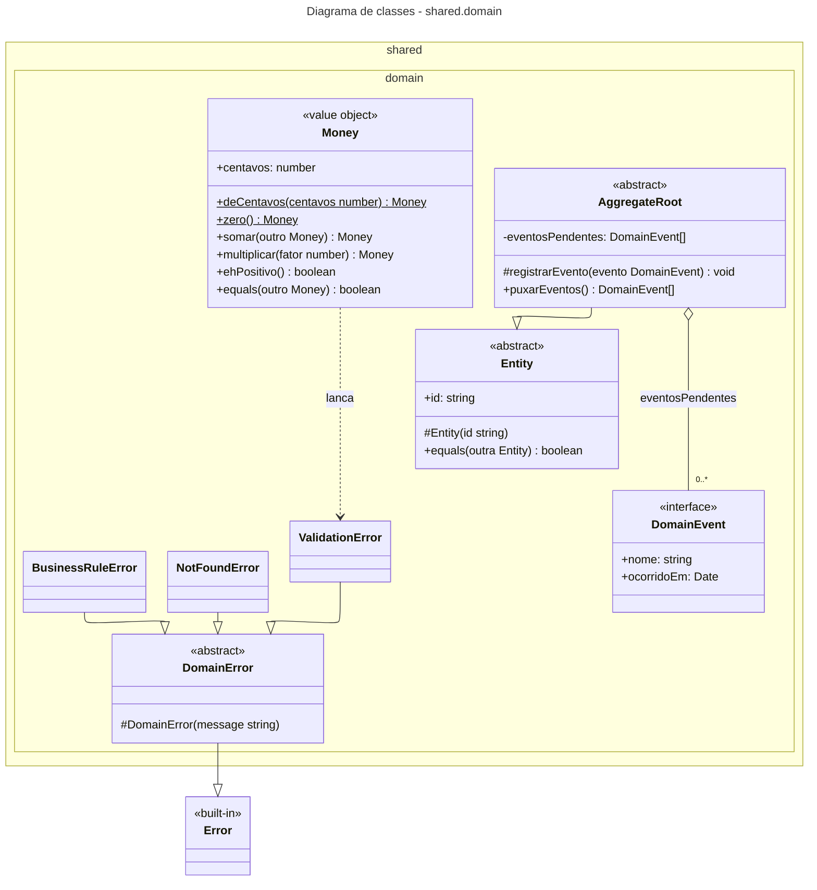

Kernel compartilhado: `Entity`, `AggregateRoot`, `DomainEvent`, `Money` e erros de domínio. **Clean Architecture:** camada mais interna, sem dependência de framework. **LSP:** erros especializam `DomainError` e são tratados de forma uniforme pelo `errorHandler`.

## Shared — application

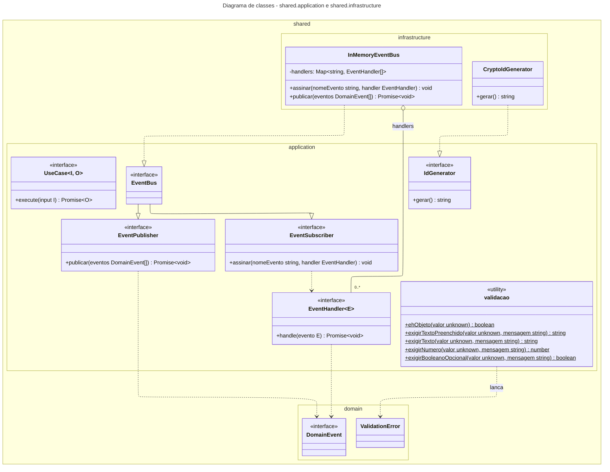

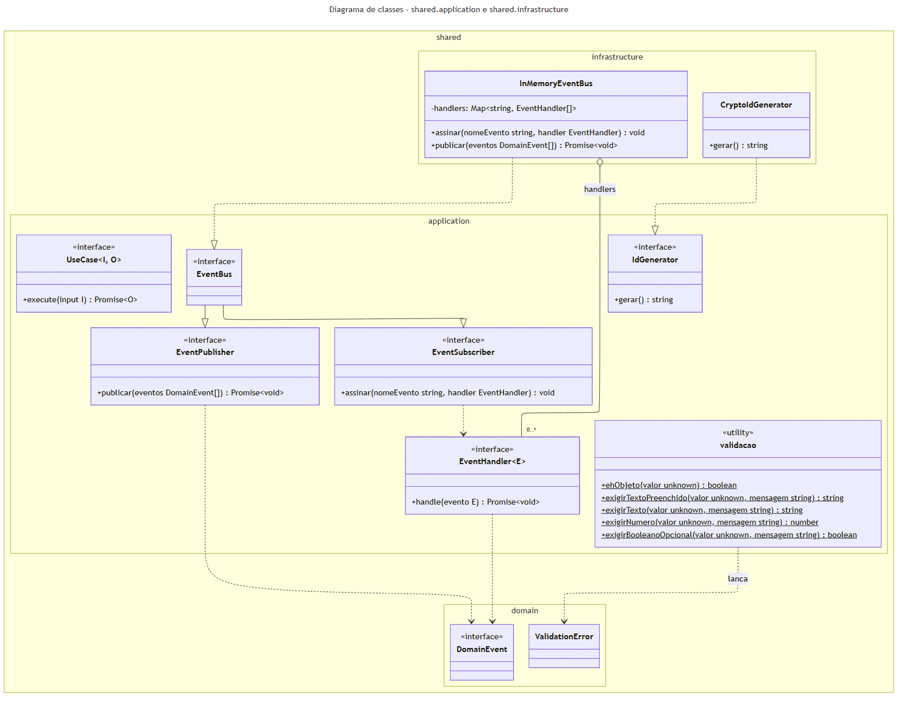

Contratos usados por todas as fatias: `UseCase<I,O>`, `EventBus` (dividido em `EventPublisher` e `EventSubscriber` — **ISP**) e `IdGenerator`. **DIP:** casos de uso dependem dessas abstrações; as implementações (`InMemoryEventBus`, `CryptoIdGenerator`) ficam em `shared/infrastructure`.

## Shared — http

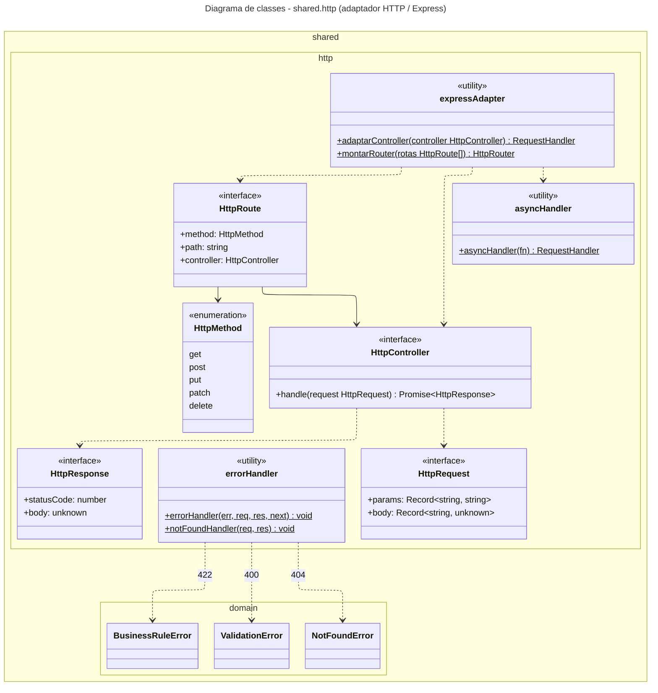

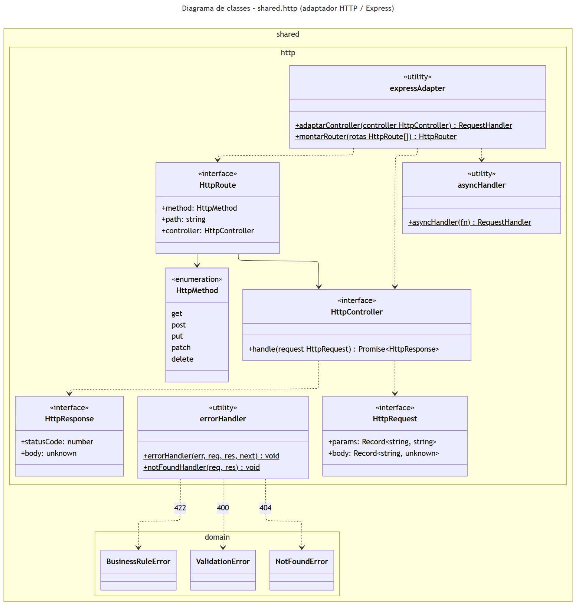

Borda HTTP: `HttpController`, `HttpRequest/HttpResponse`, adaptador Express e `errorHandler`. **Clean Architecture:** o Express fica isolado aqui e em `main`; controllers das fatias implementam `HttpController` sem conhecer o framework. **SRP:** mapeamento de erros de domínio para 400/404/422 em um único lugar.

## Módulo restaurantes

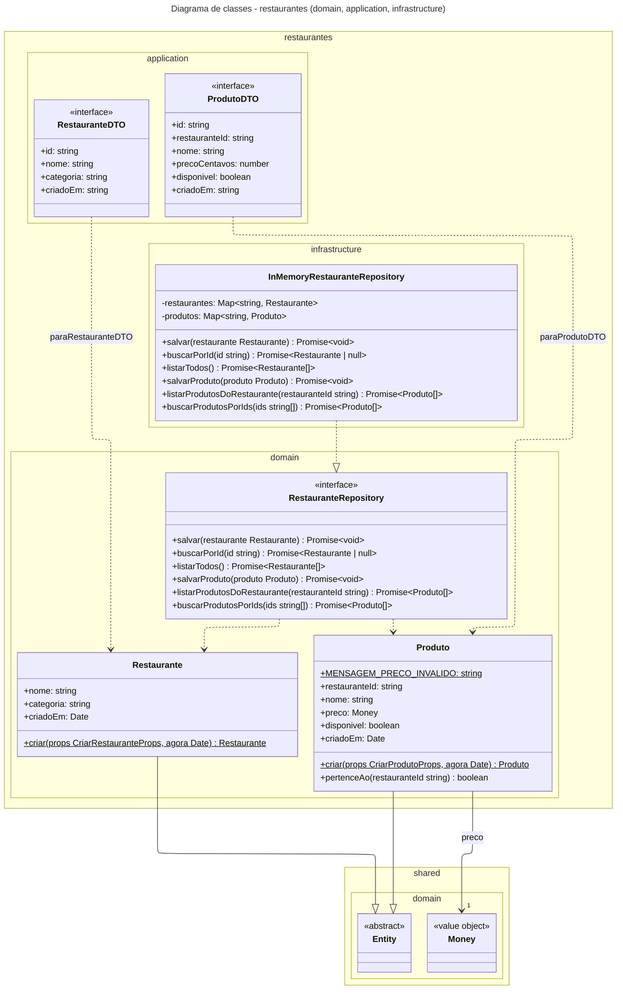

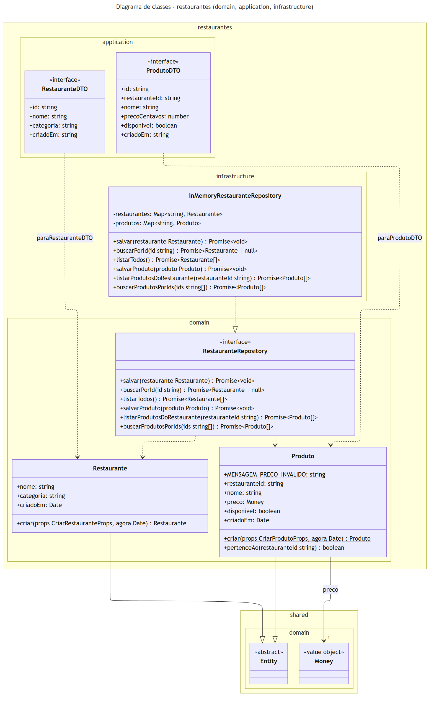

Entidades `Restaurante` e `Produto` (preço > 0 validado na entidade — **SRP**), porta `RestauranteRepository` e a implementação `InMemoryRestauranteRepository` (**LSP/DIP**). As fatias `cadastrar-restaurante`, `listar-restaurantes`, `adicionar-produto` e `listar-cardapio` seguem o mesmo padrão das fatias de pedidos.

## Módulo clientes

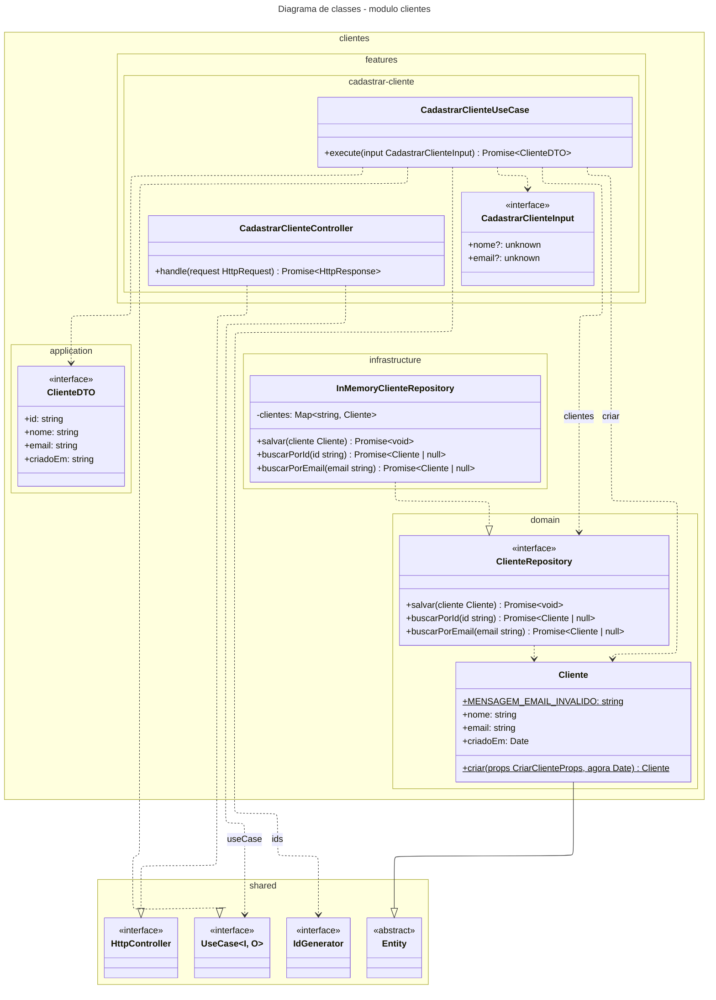

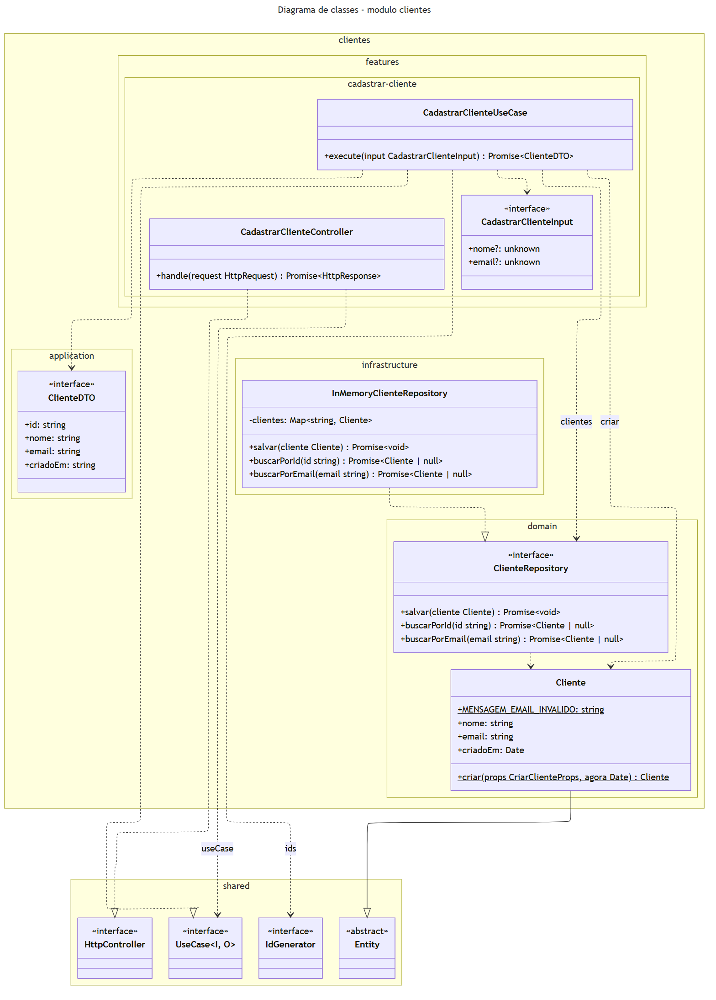

**Vertical Slice:** a fatia `cadastrar-cliente` agrupa Controller, UseCase e Input. **Clean Architecture:** `Cliente` (domínio) valida o e-mail; o caso de uso depende só de `ClienteRepository` e `IdGenerator` (**DIP**); `InMemoryClienteRepository` realiza a porta (**LSP**).

## Módulo pedidos — domain, ports e infrastructure

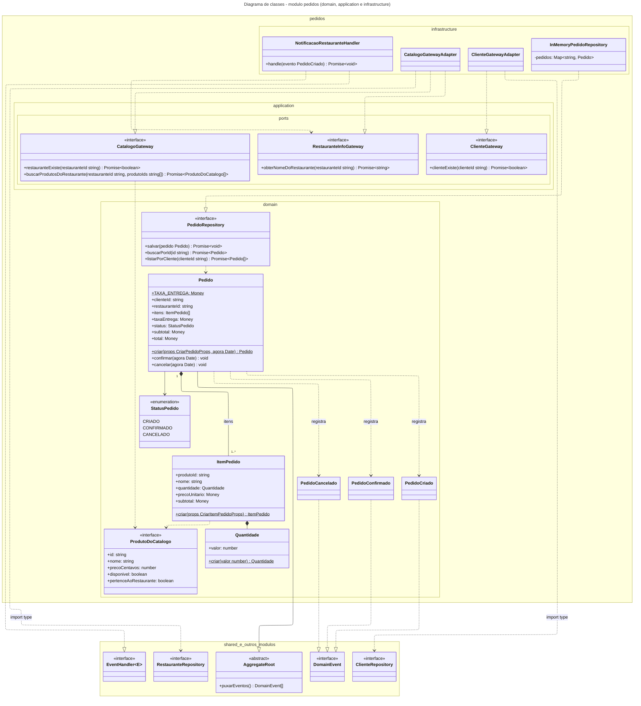

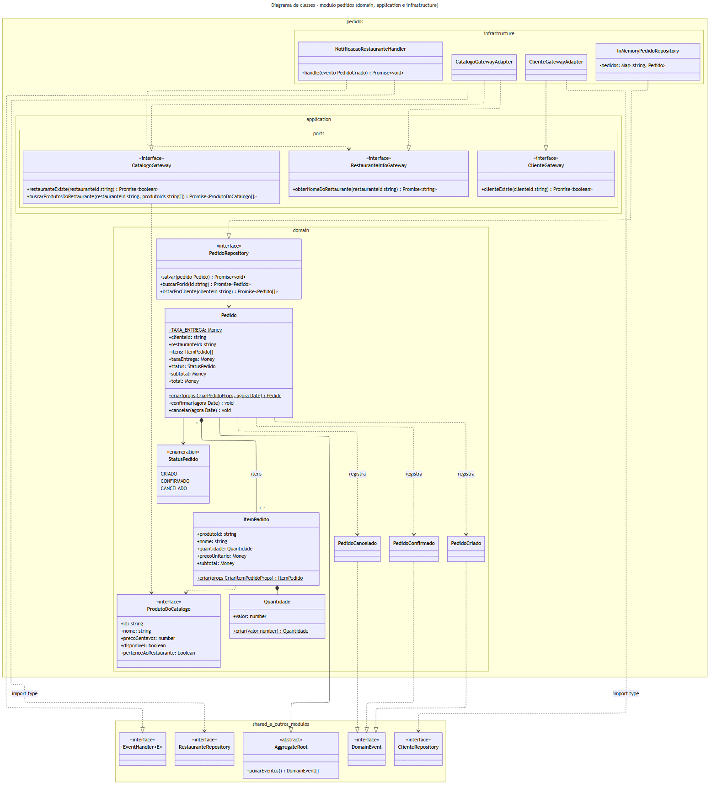

`Pedido` é a raiz do agregado (composição com `ItemPedido`), concentra total, taxa de 790 centavos e transições de status (**SRP**) e registra eventos de domínio (**EDA**). Portas pequenas `CatalogoGateway`, `ClienteGateway` e `RestauranteInfoGateway` (**ISP**) isolam o módulo de restaurantes e clientes; os adaptadores importam só as interfaces (`import type`). `NotificacaoRestauranteHandler` reage a `PedidoCriado` (**OCP**).

## Módulo pedidos — fatias verticais

```mermaid
---
title: Diagrama de classes - modulo pedidos (fatias verticais)
config:
  layout: elk
---
classDiagram
  direction TB

  namespace features.criar-pedido {
    class CriarPedidoController {
      +handle(request HttpRequest) Promise~HttpResponse~
    }
    class CriarPedidoUseCase {
      +execute(input CriarPedidoInput) Promise~PedidoDTO~
    }
  }
  namespace features.obter-pedido {
    class ObterPedidoController
    class ObterPedidoUseCase {
      +execute(input ObterPedidoInput) Promise~PedidoDTO~
    }
  }
  namespace features.listar-pedidos-do-cliente {
    class ListarPedidosDoClienteController
    class ListarPedidosDoClienteUseCase {
      +execute(input ListarPedidosDoClienteInput) Promise~PedidoDTO[]~
    }
  }
  namespace features.confirmar-pedido {
    class ConfirmarPedidoController
    class ConfirmarPedidoUseCase {
      +execute(input ConfirmarPedidoInput) Promise~PedidoDTO~
    }
  }
  namespace features.cancelar-pedido {
    class CancelarPedidoController
    class CancelarPedidoUseCase {
      +execute(input CancelarPedidoInput) Promise~PedidoDTO~
    }
  }

  namespace portas {
    class UseCase~I, O~ {
      <<interface>>
      +execute(input I) Promise~O~
    }
    class HttpController {
      <<interface>>
      +handle(request HttpRequest) Promise~HttpResponse~
    }
    class PedidoRepository {
      <<interface>>
    }
    class CatalogoGateway {
      <<interface>>
    }
    class ClienteGateway {
      <<interface>>
    }
    class EventPublisher {
      <<interface>>
      +publicar(eventos DomainEvent[]) Promise~void~
    }
    class IdGenerator {
      <<interface>>
      +gerar() string
    }
  }

  CriarPedidoController ..|> HttpController
  ObterPedidoController ..|> HttpController
  ListarPedidosDoClienteController ..|> HttpController
  ConfirmarPedidoController ..|> HttpController
  CancelarPedidoController ..|> HttpController
  CriarPedidoController ..> UseCase
  ObterPedidoController ..> UseCase
  ListarPedidosDoClienteController ..> UseCase
  ConfirmarPedidoController ..> UseCase
  CancelarPedidoController ..> UseCase

  CriarPedidoUseCase ..|> UseCase
  ObterPedidoUseCase ..|> UseCase
  ListarPedidosDoClienteUseCase ..|> UseCase
  ConfirmarPedidoUseCase ..|> UseCase
  CancelarPedidoUseCase ..|> UseCase

  CriarPedidoUseCase ..> PedidoRepository
  CriarPedidoUseCase ..> CatalogoGateway
  CriarPedidoUseCase ..> ClienteGateway
  CriarPedidoUseCase ..> IdGenerator
  CriarPedidoUseCase ..> EventPublisher
  ObterPedidoUseCase ..> PedidoRepository
  ListarPedidosDoClienteUseCase ..> PedidoRepository
  ListarPedidosDoClienteUseCase ..> ClienteGateway
  ConfirmarPedidoUseCase ..> PedidoRepository
  ConfirmarPedidoUseCase ..> EventPublisher
  CancelarPedidoUseCase ..> PedidoRepository
  CancelarPedidoUseCase ..> EventPublisher
```

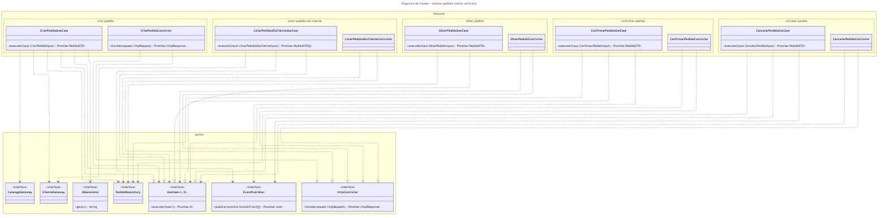

Cada fatia (`criar-pedido`, `obter-pedido`, `listar-pedidos-do-cliente`, `confirmar-pedido`, `cancelar-pedido`) tem um Controller e um UseCase próprios (**Vertical Slice**, **SRP**). Todos os casos de uso implementam `UseCase` e recebem portas por construtor (**DIP**); nenhuma fatia depende de outra.
