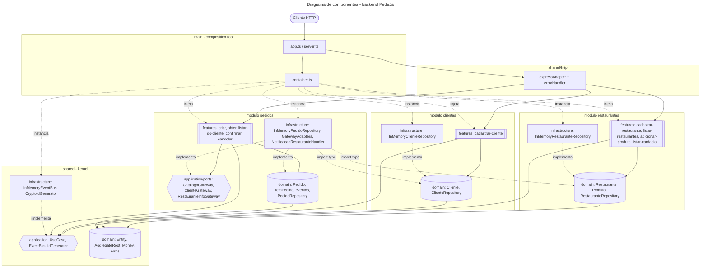
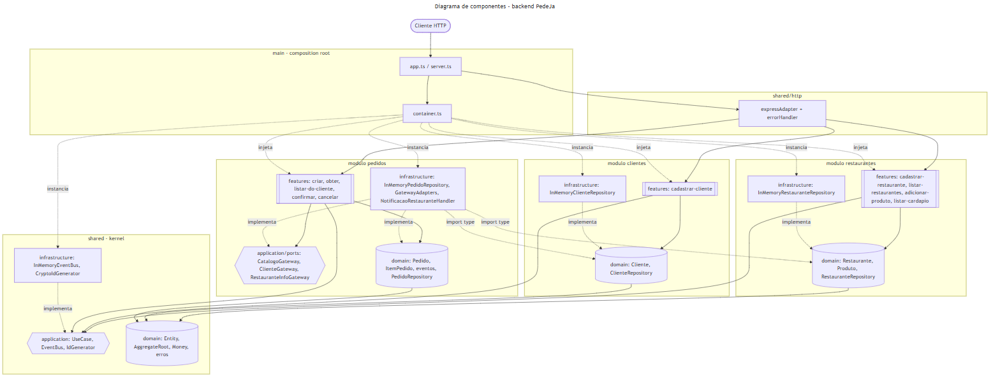
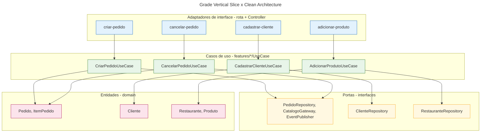
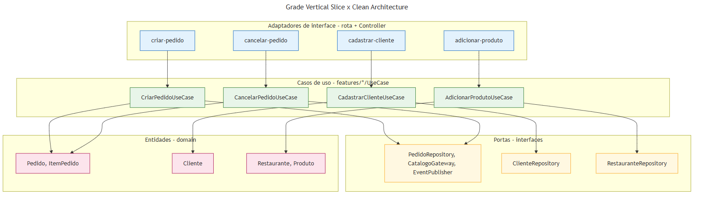

# Diagramas de componentes

Backend PedeJá — Vertical Slice + Clean Architecture + SOLID. Imagens em `img/`, código Mermaid em `mermaid/`.

## Componentes do backend

`main` (composition root) instancia a infraestrutura e injeta os casos de uso; `shared/http` encaminha as requisições às fatias. Em cada módulo, as fatias dependem do domínio e das portas, e a infraestrutura **implementa** as portas: todas as setas apontam para dentro (**Clean Architecture / DIP**). A única ligação entre módulos é `pedidos/infrastructure` → interfaces de repositório (`import type`), coberta pelos testes de arquitetura.

## Grade Vertical Slice × Clean Architecture

As colunas são fatias verticais (um caso de uso cada) e as faixas horizontais são as camadas da Clean Architecture. Cada fatia atravessa as camadas de cima para baixo (adaptador → caso de uso → portas → entidades) e nunca na direção oposta.
